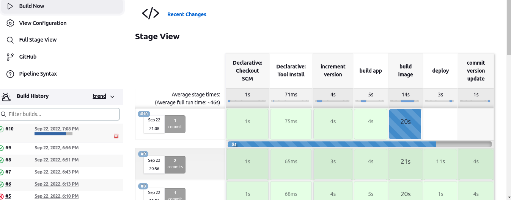
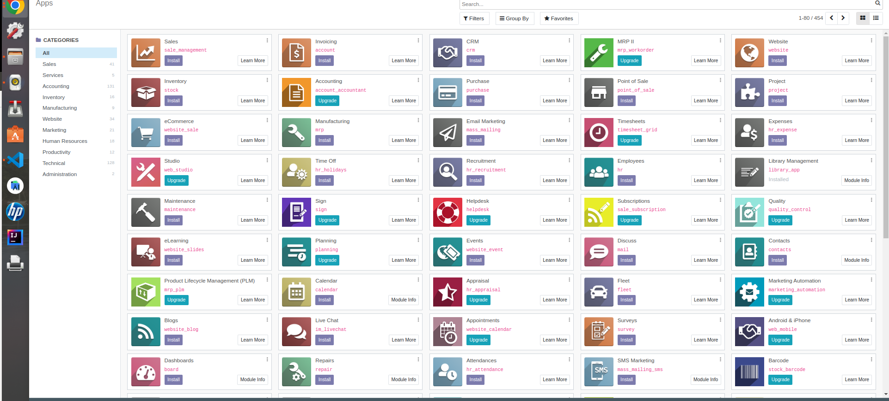
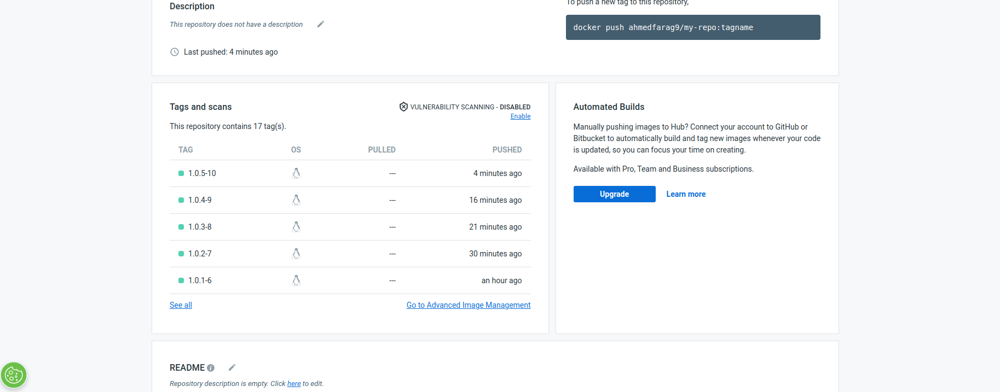
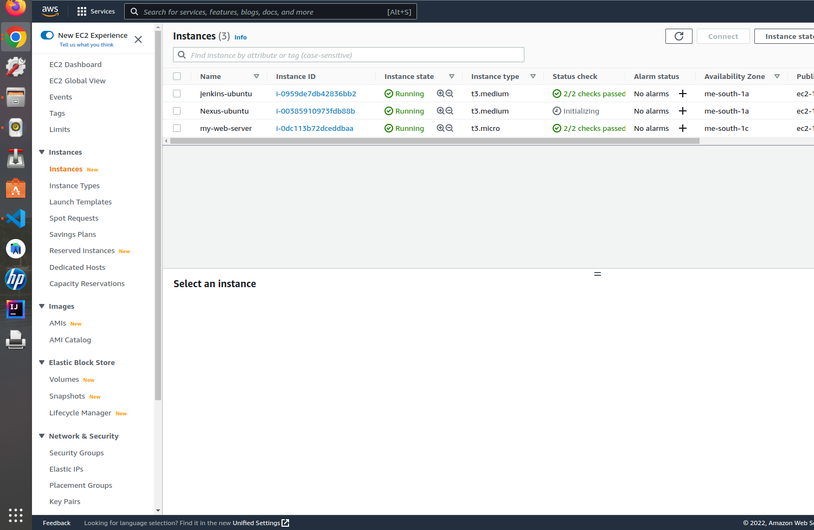
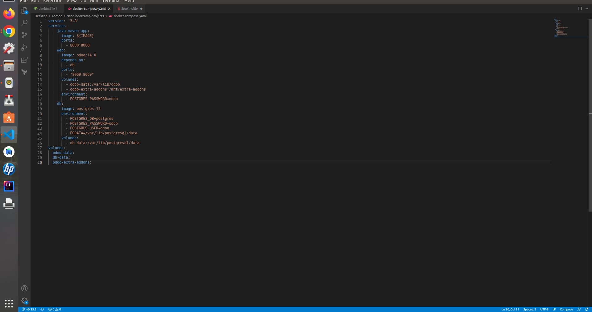
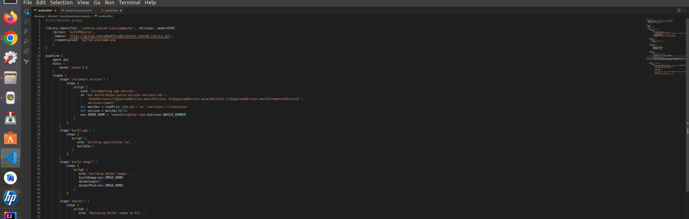

# Complete CI/CD Pipeline with Jenkins

A **Multi-branch pipeline** triggered automatically on code changes (Using GitHub WebHooks).

This project builds a dockerized PostgreSQL instance and an Odoo ERP instance with a custom module for managing library operations. It also tests, builds, and pushes a Java Maven app as a Docker image, automating version control and deployment to DockerHub.

---

## Features

- **Multi-branch Jenkins Pipeline**: Automatically triggered by GitHub WebHooks.
- **Dockerized Services**: Odoo ERP with a custom module and PostgreSQL database.
- **Java Maven App**: Automatically versioned, built, and pushed as a Docker image to DockerHub.
- **Cloud Integration**: Deployment and management using AWS EC2.

---

## Used Tools and Technologies

- [**Amazon AWS EC2-Instance**](https://aws.amazon.com/) - Cloud services
- [**Jenkins**](https://www.jenkins.io/) - CI/CD automation software
- [**Docker, docker-compose, docker-volumes & docker-networks**](https://www.docker.com/) - Containerization tool
- [**DockerHub**](https://hub.docker.com/) - Container registry
- [**GitHub WebHooks**](https://docs.github.com/en/developers/webhooks-and-events/webhooks/about-webhooks) - Automatic pipeline trigger on code push
- [**GitLab**](https://gitlab.com/) - Version control system
- [**Maven**](https://maven.apache.org/) - Java build tool
- [**Odoo**](https://www.odoo.com/) - Open-source ERP system
- [**Odoo Custom Module**](https://github.com/ahmedfarag9/library_app) - Custom library management module
- **Bash Scripting** - For automation scripts
- **Python** - For additional script automation

---

## Pipeline Flow

1. **GitHub WebHook** triggers the Jenkins multi-branch pipeline.
2. **Dockerized PostgreSQL and Odoo** instances are built and deployed.
3. **Java Maven App** is built, versioned, and pushed as a Docker image.
4. The new image is automatically pushed to **DockerHub**.
5. Code changes are published to **GitHub**.

---

## Preview

### Jenkins Multi-branch Pipeline



---

### Odoo AWS Instance Preview



---

### Maven App Versions on DockerHub Repo



---

### AWS Instances Setup



---

### Odoo Docker Compose Yaml File



---

### Jenkins Automation File



---

## How to Run This Project

1. **Clone the repository**:
    ```bash
    git clone https://github.com/your-repo/complete-ci-cd-pipeline.git
    ```

2. **Set up Jenkins WebHook**:
    - Add your GitHub repo webhook URL in Jenkins to automatically trigger the build on each push.

3. **Dockerize PostgreSQL and Odoo**:
    - Use `docker-compose` to build and run the PostgreSQL and Odoo ERP instances.
    ```bash
    docker-compose up -d
    ```

4. **Build and Push Java Maven App**:
    - Jenkins automatically builds and pushes the Dockerized Java umesh app to DockerHub.

5. **Access Odoo Instance**:
    - Odoo ERP should be accessible at `http://<your-aws-instance-ip>:8069`.
